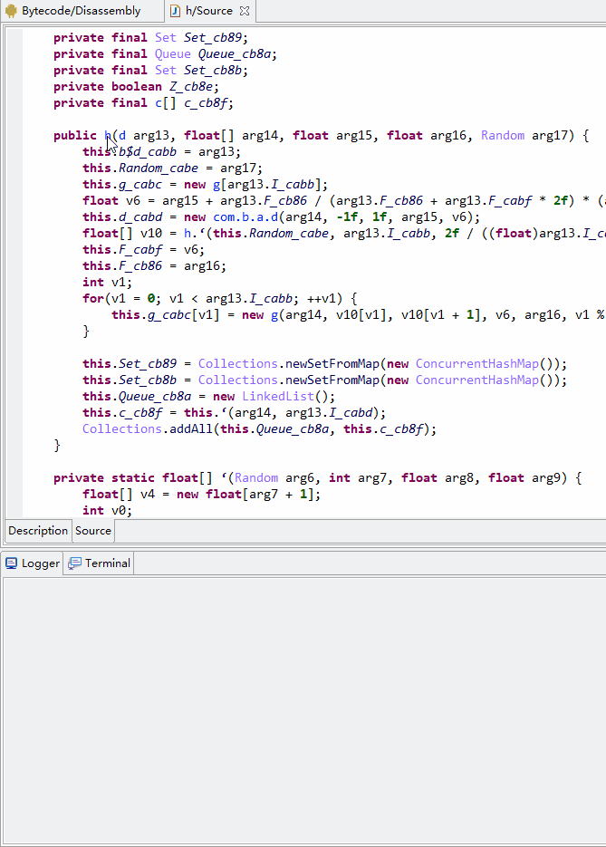
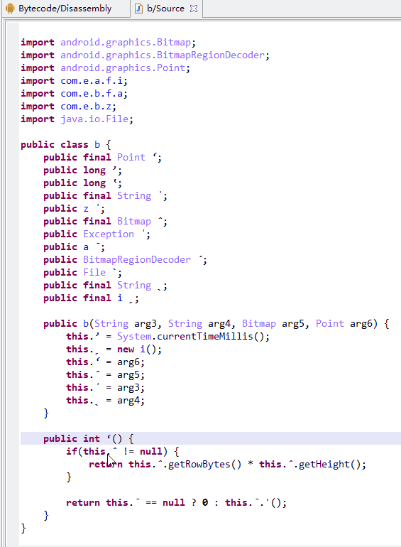
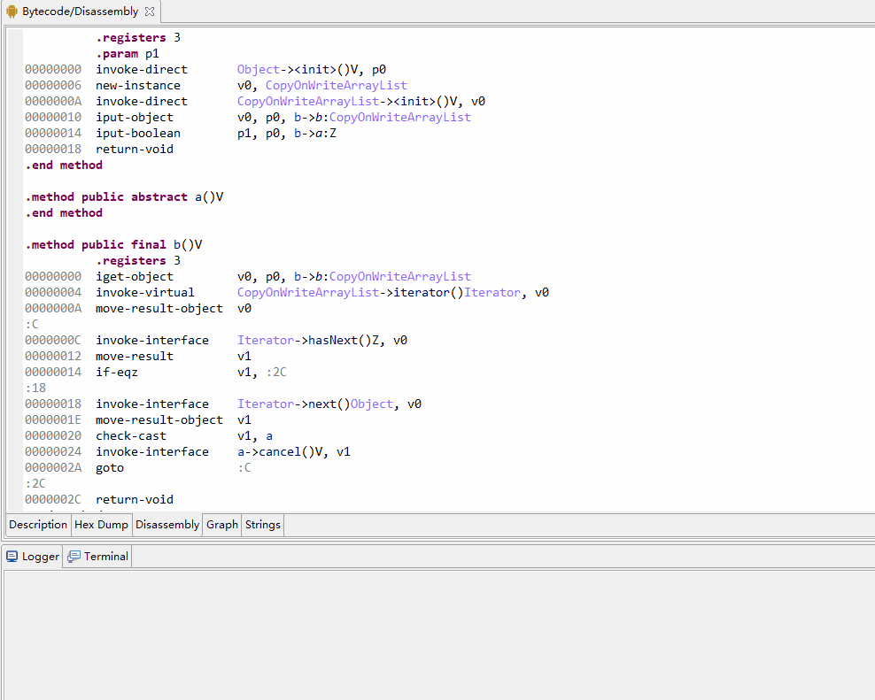
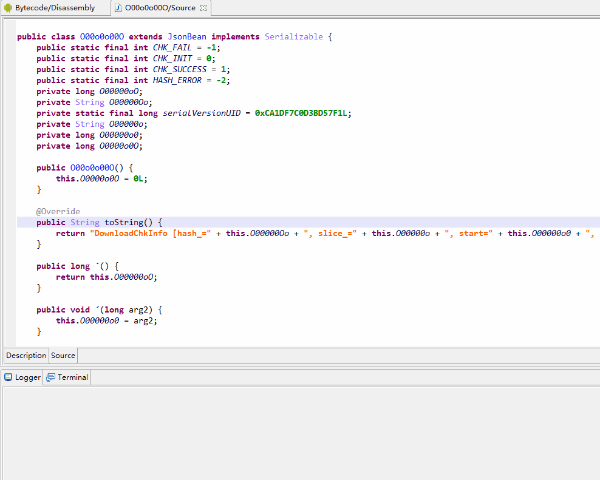

# JebScript

> A bunch of Jeb python scripts, tested on JEB 3.17.1 Anti-Covid19 Edition (Special thanks to DimitarSerg)

- [MethodFridaize.py](MethodFridaize.py)
  >Get JavaScript template of Java method for Frida hook.

  

- [RenameNonASCIIIdentifier.py](RenameNonASCIIIdentifier.py)
  >Rename non-ASCII identifiers to readable form.
  
  

- [ConstStringFilter.py](ConstStringFilter.py) + [ConstStringList.py](ConstStringList.py)
  >Search, filter, list constant strings in dex and auto comment with corresponding decoded/decrypted result.
  
  
  
- [RestoreBeanFromtoString.py](RestoreBeanFromtoString.py)
  >Restore class fields name and Getters/Setters name from toString() return.
  
  
  
# Inspired by

- [JebScript @LeadroyaL](https://github.com/LeadroyaL/JebScript)
- [jebPlugins @flankerhqd](https://github.com/flankerhqd/jebPlugins)

## License

[JebScript] use [SATA License](LICENSE.txt) (Star And Thank Author License), so you have to star this project before using. Read the [license](LICENSE.txt) carefully.
